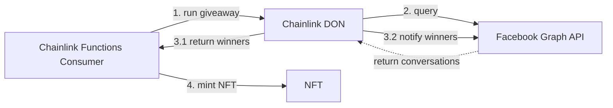

# Chainlink Functions <> Meta NFT #Giveaway

Showcase project for NFT Giveaways on Facebook and Instagram pages. 

Chainlink Functions allows users to request data from almost any API and perform custom computation using JavaScript. This project is currently in a closed beta. Request access to send on-chain requests at https://functions.chain.link

## What we are building

We are creating a system for NFT giveaways on Facebook and Instagram pages. To enter the giveaway User needs to send its wallet address alongside #giveaway hashtag via direct message. 

The Chainlink Functions Consumer smart contract will start the giveaway by sending the request to the Chainlink Decentralized Oracle Network (DON). The query to Facebook Graph API will be sent to get latest messages from conversations with our Giveaway page starting from provided date. 

After calculations for chosing eligible wallet addresses, the callback with winners will be sent to the Consumer smart contract. It will mint Giveaway NFTs which can be viewed as Instagram Digital Collectibles. Notifications will be sent to winners via direct messages.

 <span /><span /><span /> 

# Overview

Chainlink Functions works by using a <a href="https://chain.link/education/blockchain-oracles#decentralized-oracles">decentralized oracle network</a> (DON). When a request is initiated, each node in the DON executes the user-provided JavaScript code simultaneously.  Then, nodes use the <a href="https://docs.chain.link/architecture-overview/off-chain-reporting/">Chainlink OCR</a> protocol to come to consensus on the results.  Finally, the median result is returned to the requesting contract via a callback function.</p>

Chainlink Functions also enables users to share encrypted secrets with each node in the DON.  This allows users to access to APIs that require authentication, without exposing their API keys to the general public.

## How to build it from scratch

Before we start make sure that you have the Facebook Profile created. Using it, log in to the [Meta for Developers](https://developers.facebook.com/).

For this demo we are going to use the Facebook Graph API. You will need to create the Facebook Business Page and connect it to the Instagram Businnes Page. Make sure to follow the step by step instructions from the [Conversations API for Messenger Platform](https://developers.facebook.com/docs/messenger-platform/conversations). If you are more of a visual learner, check the tutorial video below.

[](https://youtu.be/Pi2KxYeGMXo)

Create new app at Meta for Developers platform and save **Graph API Access Token**. Save it as `FACEBOOK_GRAPH_API_KEY` .env variable.

At Graph API Explorer run the following command to get your Business Page **ID**. Save it as `FACEBOOK_PAGE_ID` .env variable.
```
GET/v16.0/me
```
The output should look like this
```
{
  "name": "giveaways___page",
  "id": "123456789"
}
```

Send some test messages from regular Facebook profiles to your Business Page. Make sure that at least three of them include valid Ethereum wallet address and hashtag #giveaway.

To get the list of conversations of your Business page check **Get a List of Conversations** section of [Conversations API for Messenger Platform](https://developers.facebook.com/docs/messenger-platform/conversations).

To get the list of messages for a given conversation check **Get a List of Messages in a Conversation** section of [Conversations API for Messenger Platform](https://developers.facebook.com/docs/messenger-platform/conversations).

To get details of a single message from the above list check **Get Information about a Message** section of [Conversations API for Messenger Platform](https://developers.facebook.com/docs/messenger-platform/conversations).

We can optimize this process and get all of the relevant data using the single query:
```
curl -i -X GET https://graph.facebook.com/v16.0/${secrets.FACEBOOK_PAGE_ID}/conversations?fields=messages.limit(1){message,from},updated_time&access_token=${secrets.FACEBOOK_GRAPH_API_KEY}
```

To send the callback notification messages make sure to add those profiles as **Testers** of your Meta for Developers app, otherwise you won't be able to send them messages. Add User IDs of Testers to `TESTER_ACCOUNTS_IDS` .env variable.

### How it works



## Quickstart

### Prerequisites

Be sure to have installed the following

- [Git](https://git-scm.com/book/en/v2/Getting-Started-Installing-Git)
- [Node.js](https://nodejs.org/en/download/) version 18.0 or greater

### Installation

1) Clone the repo
```
git clone https://github.com/andrejrakic/chainlink-functions-facebook-giveaway.git
cd chainlink-functions-facebook-giveaway
```
2) Install packages
```
npm install
```

This repo uses the NPM package `@chainlink/env-enc` for keeping environment variables such as wallet private keys, RPC URLs, and other secrets encrypted at rest. This reduces the risk of credential exposure by ensuring credentials are not visible in plaintext.

By default, all encrypted environment variables will be stored in a file named `.env.enc` in the root directory of this repo.

> **Warning**
>
> **DO NOT COMMIT YOUR `.env.enc` FILE**

3) Aquire a Github personal access token which allows reading and writing Gists

- Visit https://github.com/settings/tokens?type=beta and click "Generate new token"
- Name the token and enable read & write access for Gists from the "Account permissions" drop-down menu. Do not enable any additional permissions.
- Click "Generate token" and copy the resulting personal access token for step 4

4) Set an encryption password for your environment variables to a secure password
```
npx env-enc set-pw
```
The password must be set at the beginning of each new session. If this password is lost, there will be no way to recover the encrypted environment variables.

5) Set the required environment variables
```
npx env-enc set
```
- `PRIVATE_KEY`: Your Ethereum account private key.
- `MUMBAI_RPC_URL`: RPC URL of the node provider(e.g., Infura, Alchemy… etc.) that will allow you to connect to the Polygon Mumbai testnet.
- `POLYGONSCAN_API_KEY`: API key of Polygonscan.
- `FACEBOOK_GRAPH_API_KEY`: Meta for Developers access token
- `FACEBOOK_PAGE_ID`: The ID of your Facebook/Instagram Business Page
- `TESTER_ACCOUNTS_IDS`: The array of Tester accounts IDs

Run the command `npx env-enc set` to set and save environment variables. These variables will be loaded into your environment when the `config()` method is called at the top of `hardhat.config.js`. Use `npx env-enc view` to view all currently saved environment variables. When pressing _ENTER_, the terminal will be cleared to prevent these values from remaining visible. Running `npx env-enc remove VAR_NAME_HERE` deletes the specified environment variable. The command `npx env-enc remove-all` deletes the entire saved environment variable file.

6) Compile smart contracts
```
npx hardhat compile
```

7) Simulate on-chain execution
```
npx hardhat functions-simulate
```

The output should look like this:
```
__Compiling Contracts__
Nothing to compile

Executing JavaScript request source code locally...

__Console log messages from sandboxed code__

__Output from sandboxed source code__
Output represented as a hex string: 0x4943d0a0b6727e5a6b50cbae42aa2a1c194f381d8fdea7a82d7861144d027e4eb2acccf4eb37bb056c235b011b85b6b92a60401d235737a11e95b3cd

Gas used by sendRequest: 422763
Gas used by client callback function: 785345
```

## Deploy to Polygon Mumbai Testnet

Make sure that you have claimed test MATIC and test LINK tokens from the [Chainlink Faucet](https://faucets.chain.link).

1) Create and Fund a Subscription
```
npx hardhat functions-sub-create --amount REPLACE_LINK_AMOUNT --network mumbai
```

2) Deploy the Chainlink Functions Consumer Contract
```
npx hardhat functions-deploy-client --verify true --network mumbai
```

3) Add a consumer contract to a Subscription
```
npx hardhat functions-sub-add --subid REPLACE_SUBSCRIPTION_ID --contract REPLACE_CONSUMER_CONTRACT_ADDRESS --network mumbai
```
